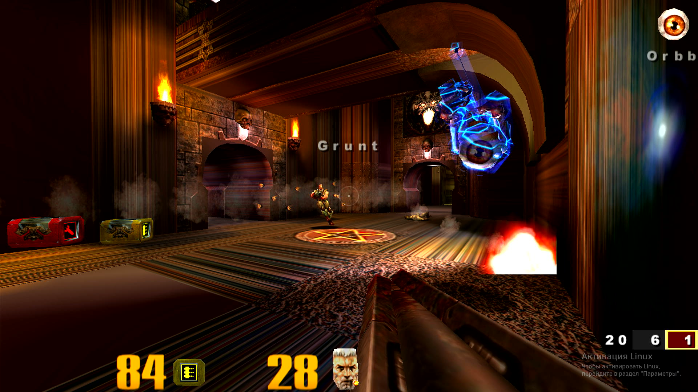
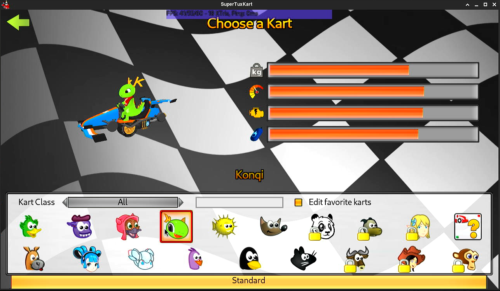
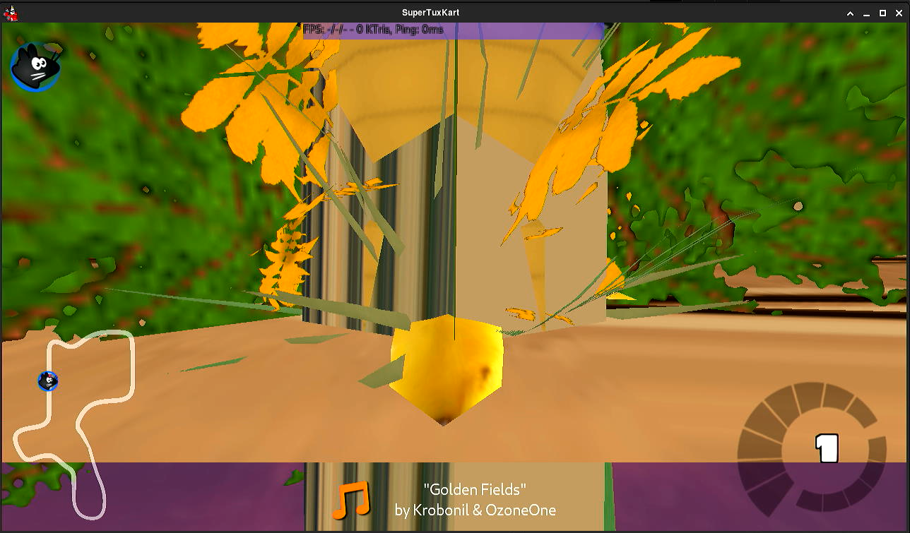

# mesa-terakan-mimo-development

Modified Terakan Vulkan driver source files and packaging for AMD TeraScale GPUs (R600–Northern Islands, HD 2000–7000, pre-GCN).

Contains **modified Mesa source files** under `src/`, scripts, and Arch Linux packaging. Clone upstream Mesa separately or use the working tree at `/home/shipa/terakan-mesa-state-rework`.

**Agent workflow:** see [AGENTS.md](AGENTS.md).

## Upstream

| Item | Value |
|------|--------|
| Project | [Mesa Terakan](https://gitlab.freedesktop.org/Triang3l/mesa) |
| Branch | [`Terakan_state_rework`](https://gitlab.freedesktop.org/Triang3l/mesa/-/tree/Terakan_state_rework) (`a5fc39658` and newer) |
| Author | Vitaliy Triang3l Kuzmin |

## Quick start

```bash
git clone --branch Terakan_state_rework --single-branch \
  https://gitlab.freedesktop.org/Triang3l/mesa.git /home/shipa/terakan-mesa-state-rework

# Copy modified source files into the Mesa tree
cp -r /home/shipa/Projects/mesa-terakan-mimo-development/src/* \
  /home/shipa/terakan-mesa-state-rework/src/

cd /home/shipa/terakan-mesa-state-rework
meson setup build-vulkan --prefix=/usr -Dvulkan-drivers=amd_terascale -Dgallium-drivers= ...
meson compile -C build-vulkan
```

See [docs/BUILD.md](docs/BUILD.md) for full build instructions.

## Modified source files

| Directory | Description |
|-----------|-------------|
| `src/amd/terascale/vulkan/` | Vulkan driver: compute, blit, draw indirect, descriptor indexing, state management |
| `src/amd/terascale/vulkan/meta/` | Meta shaders: blit image, copy buffer/image |
| `src/c11/` | C23 compatibility (glibc 2.42+, GCC 16) |
| `src/gallium/drivers/r600/` | SFN shader fixes |
| `src/util/` | C11 monotonic condition variable fixes |

## Screenshots

Place screenshot files in `screenshots/` directory. Current captures (2026-06):

### vkQuake3 (Vulkan renderer)



**Analysis:** BSP surfaces (floors, walls) using multi_texture pipeline (diffuse + lightmap) show **horizontal stripes** instead of correct textures. Single_texture elements (weapon model, enemy model, HUD, fire effects) render correctly. The stripe pattern is thin horizontal bands of alternating colors — consistent with V texcoord being approximately constant across the surface.

**Root cause investigation status:**
- ✅ `vkCmdCopyBufferToImage` works — root cause was `layerCount=0` in test; ioquake3 correctly uses `layerCount=1`
- ✅ VTX fetch format identical for single/multi_texture (`0x07961000` = `FLOAT_32_32`, `DST_SEL=X,Y,0,1`)
- ✅ Resource descriptors correct: all 4 bindings with VA, stride=16/4/8/8, size
- ✅ Descriptor sets correct: set 0=diffuse, set 1=lightmap
- ❌ **Hypothesis:** SPI_VS_OUT_ID / SPI_PS_INPUT_CNTL `spi_sid` mismatch — SPI hardware matches VS exports → FS inputs by `spi_sid` (= `varying_slot + 1`); single_texture.vert skips location 2 (gap at loc 2), multi_texture.vert uses dense 0–3 — different slot layouts may cause mismatch

### SuperTuxKart — kart selection screen



**Analysis:** 2D rendering and UI elements work correctly. Kart model (Konqi) renders properly with correct textures and lighting. UI text, icons, stat bars, and kart selection grid all display without artifacts. This confirms the basic rendering pipeline, descriptor indexing, and combined image samplers work for 2D UI.

### SuperTuxKart — race gameplay



**Analysis:** 3D race track has rendering artifacts:
- Kart model (yellow) visible at center — correct shape but may have wrong position
- Ground/track textures partially correct (sand color, tree foliage)
- **Vertical striped artifacts** on central 3D geometry — vertical lines of varying color
- Minimap (bottom-left) works correctly
- HUD elements (speedometer, position, music notification) render correctly
- Sky background renders correctly

**Comparison with vkQuake3:** Different stripe orientation (vertical vs horizontal) suggests the bug affects different varying components depending on the shader layout — ioquake3 has V-texcoord issue (horizontal stripes), STK has position/normal varying issue (vertical stripes). Both point to the same root cause: **SPI varying matching failure in the r600 backend**.

---

## Current test results (Palm R8xx, 2026-06)

| Test | Result |
|------|--------|
| `terakan-test-compute` | ✅ PASS `{1,2,3,4}` |
| `vkcube` | ✅ |
| `vkgears` | ✅ |
| vkQuake3 (Vulkan) | ⚠️ multi_texture horizontal stripes on BSP surfaces; single_texture OK |
| SuperTuxKart (Vulkan) | ⚠️ 2D OK; 3D race has vertical striped artifacts on geometry |

## Vulkan 1.1 coverage and missing functions

**Current coverage:** ~80–85% of entrypoints callable, ~75% GPU path for typical 3D.

**Conformance:** 0% (testing use only — not conformant).

### Implemented (1.0 + promoted 1.1)

| Area | Status |
|------|--------|
| Instance / Device / PhysicalDevice | ✅ |
| Memory (allocate, map, bind, external fd/dma-buf, dedicated) | ✅ |
| Buffer / Image /ImageView / Sampler | ✅ |
| Graphics pipeline, shader module, layout | ✅ |
| Dynamic rendering, draw, bind state | ✅ |
| Descriptors, push constants, `VK_EXT_descriptor_indexing` | ✅ |
| Barriers (`CmdPipelineBarrier2`) | ✅ |
| Copy / UpdateBuffer / FillBuffer | ✅ |
| Blit (`CmdBlitImage2`) | ⚠️ R8xx (scaled blit hangs) / ✅ R9xx |
| Clear color / attachments | ✅ |
| Queries (occlusion, timestamp) | ✅ |
| `CmdDrawIndirect` + `CmdDrawIndexedIndirect` | ✅ |
| `CmdDispatchBase` | ✅ non-zero base via `VGT_COMPUTE_START_*` |
| `shaderDrawParameters` | ✅ |
| Compute MVP (`CreateComputePipelines`, `CmdDispatch`, SSBO write) | ✅ |
| `VK_KHR_maintenance3` + `GetDescriptorSetLayoutSupport` | ✅ |
| `SubgroupProperties` | ✅ subgroupSize from wave_lanes, COMPUTE stage, BASIC ops |
| `DriverProperties` | ✅ driverID=MESA_RADV, name=Terakan, conformance 1.1.0.0 |
| `dualSrcBlend` | ✅ advertised |
| WSI (swapchain, acquire/present) | ✅ |
| Fence / Semaphore (incl. timeline) | ✅ |
| `VK_KHR_dynamic_rendering` | ✅ |
| `VK_KHR_swapchain` (+ mutable format) | ✅ |
| `VK_KHR_timeline_semaphore` | ✅ |
| `VK_KHR_external_memory` (+ fd, dma-buf) | ✅ |
| `VK_KHR_bind_memory2`, `map_memory2` | ✅ |
| `VK_EXT_descriptor_indexing` | ✅ |
| `VK_EXT_extended_dynamic_state` (+3) | ✅ |
| `VK_EXT_vertex_input_dynamic_state` | ✅ |
| `VK_EXT_depth_clip_enable` / `depth_clip_control` | ✅ |
| `VK_EXT_provoking_vertex` | ✅ |
| `VK_KHR_vertex_attribute_divisor` | ✅ |
| `VK_KHR_format_feature_flags2` | ✅ |
| `VK_EXT_texel_buffer_alignment` | ✅ |
| `VK_EXT_4444_formats` | ✅ |
| `VK_EXT_non_seamless_cube_map` | ✅ |
| `VK_EXT_color_write_enable` | ✅ |
| `VK_EXT_host_query_reset` | ✅ |
| `VK_EXT_sample_locations` | ✅ |
| `VK_EXT_pci_bus_info` | ✅ |
| `VK_EXT_external_memory_dma_buf` | ✅ |
| `VK_EXT_external_memory_fd` | ✅ |

### Missing — Required for Vulkan 1.1 conformance

#### Core commands without GPU path

| API Function | Priority | Description | Implementation effort |
|-------------|----------|-------------|----------------------|
| `vkCmdDrawIndirectCount` | P2 | Indirect draw with GPU-side vertex count | Medium — extend `CmdDrawIndirect` |
| `vkCmdDrawIndexedIndirectCount` | P2 | Indexed indirect draw with GPU-side count | Medium — extend `CmdDrawIndexedIndirect` |
| `vkCmdClearDepthStencilImage` | P2 | Clear depth/stencil via meta shader | Medium — similar to color clear |
| `vkCmdResolveImage` / `vkCmdResolveImage2` | P2 | MSAA resolve | Medium — meta shader |
| `vkMergePipelineCaches` | P2 | Merge pipeline cache data | Small — serialize + merge |
| `vkGetPipelineCacheData` | P2 | Export pipeline cache | Medium — dump shader bytecode |

#### Core features not advertised

| Feature | Priority | Description | Implementation effort |
|---------|----------|-------------|----------------------|
| `geometryShader` | P3 | Geometry shader support | Large — limited benefit on TeraScale |
| `tessellationShader` | P3 | Tessellation shader support | Large — limited benefit on TeraScale |
| `sampleRateShading` | P3 | Per-sample shading | Small — hardware support limited |
| `wideLines` / `largePoints` | P3 | Wide line/point rendering | Small — hardware support limited |
| `shaderFloat64` | P3 | 64-bit float in shaders | 🚫 Not available on TeraScale |
| `dualSrcBlend` | P0 | Dual-source blending | Check — may already work |

#### Core promoted extensions not implemented

| Extension | Priority | Description | Implementation effort |
|-----------|----------|-------------|----------------------|
| `VK_KHR_maintenance3` → `vkGetDescriptorSetLayoutSupport` | P2 | Layout validation | Small |
| `VK_KHR_maintenance4` | P2 | Max buffer size, 32-bit VA limits | Small — advertise limits |
| `VK_KHR_multiview` | P3 | Multi-view rendering | Medium — limited benefit |
| `VK_KHR_sampler_ycbcr_conversion` | P3 | YCbCr texture sampling | Large — significant work |
| `VK_KHR_protected_memory` | P3 | Protected content | 🚫 Not available on old Radeon |
| `VK_KHR_device_group` | P3 | Multi-GPU | 🚫 Single GPU only |
| Sparse binding / residency | P3 | Sparse resources | 🚫 Not available |

#### Properties/Features structures to report

| Structure | Priority | Description |
|-----------|----------|-------------|
| `VkPhysicalDevice16BitStorageFeatures` | P1 | 16-bit storage access |
| `VkPhysicalDeviceMultiviewFeatures` / `Properties` | P3 | Multi-view support |
| `VkPhysicalDeviceVariablePointerFeatures` | P1 | Variable pointer access |
| `VkPhysicalDeviceProtectedMemoryFeatures` / `Properties` | P3 | Protected memory |
| `VkPhysicalDeviceSamplerYcbcrConversionFeatures` | P3 | YCbCr conversion |
| `VkPhysicalDeviceShaderDrawParameterFeatures` | P1 | Shader draw parameters |
| `VkPhysicalDeviceIDProperties` | P0 | Device ID, PCI bus info |
| `VkPhysicalDeviceMaintenance3Properties` | P2 | Max per-stage resources |
| `VkPhysicalDeviceMultiviewProperties` | P3 | Multi-view limits |
| `VkPhysicalDeviceExternalBufferInfo` | P2 | External buffer capabilities |
| `VkPhysicalDeviceExternalFenceInfo` | P2 | External fence capabilities |
| `VkPhysicalDeviceExternalSemaphoreInfo` | P2 | External semaphore capabilities |
| `VkPhysicalDeviceFloat16Int8Features` | P2 | Float16/Int8 support |
| `VkPhysicalDevicePointClippingProperties` | P1 | Point clipping behavior |
| `VkPhysicalDeviceSubgroupProperties` | P1 | Subgroup operations |
| `VkPhysicalDeviceDriverProperties` | P1 | Driver name, info |

### Conformance gap summary

| Metric | Coverage |
|--------|----------|
| Core 1.1 entrypoints callable | ~85–90% |
| Core 1.1 features advertised | ~70–80% |
| GPU execution path for typical 3D | ~75–80% |
| Khronos CTS 1.1 conformance | 0% |

### Hardware limits (not fixable by software)

- **18 samplers per shader stage** — apps needing 512 bindless samplers require descriptor indexing + rebinding
- **4 storage buffers per stage** — DXVK/Vulkan minimum met; large bindless not possible
- **32-bit VA in IB** — maintenance4 max buffer size limited
- Single shared GPU — GPU hang freezes the whole desktop session
- SQ CF ALU kcache bank is 4-bit (0–15) — LDS info const buffer uses slot 15

## Testing

```bash
# After deploy to Palm /tmp/terakan-deploy/
export VK_ICD_FILENAMES=/tmp/terakan-deploy/terascale_icd.json

terakan-test-capabilities   # vkcube, vkgears, vulkaninfo
/tmp/terakan-deploy/terakan-test-compute   # expect PASS

# Build compute test locally
cc -O2 -o terakan-test-compute scripts/terakan-test-compute.c -lvulkan
```

## Arch Linux package

```bash
cd packaging/archlinux
makepkg -sf
```

See [docs/PACKAGING.md](docs/PACKAGING.md).

## Roadmap

[docs/ROADMAP.md](docs/ROADMAP.md) — SPI varying match fix (P0), then `CmdDrawIndirectCount`, pipeline cache, MSAA resolve, etc.

## License

Mesa is MIT and other licenses — see upstream `docs/license.rst`. Patches and scripts in this repo are MIT unless noted otherwise.
